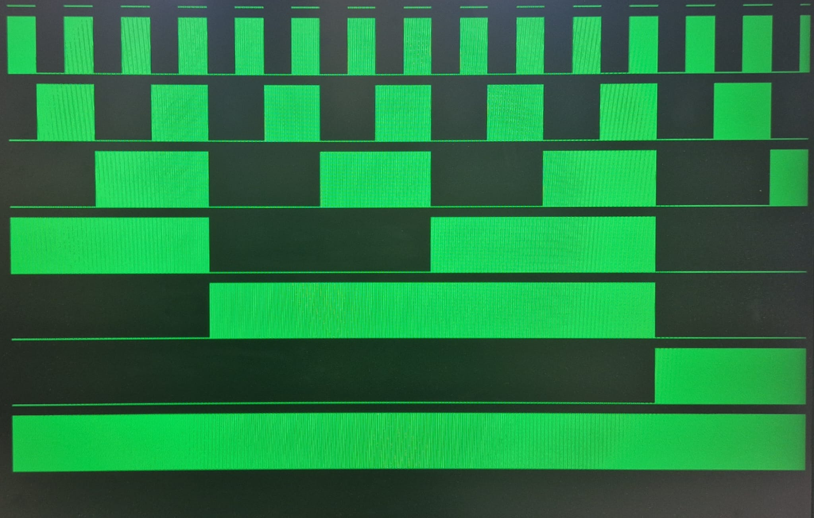

# Logic Analyser

A FPGA hardware project for analyzing digital signals on the Xilinx FPGA Development board, developed as part of a university practical course.
 *Software used: Vivado*

## Features

- Captures and visualizes digital logic signals
- **VGA output**
- **Modular hardware design**

## Project Structure

- `src/` - Source code and firmware
- `img/` - Project images and diagrams

## Preview

